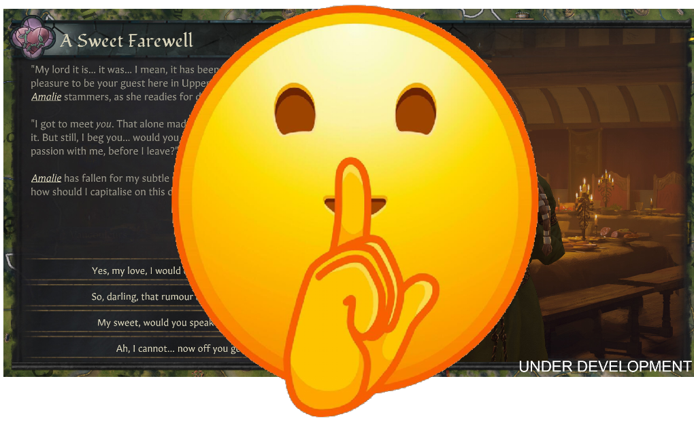

# Current Mod Description (As Shown on Steam):
**Currently Supports Game Version 1.18**

This mod is a successor to ***"Less Event Spam"*** mod by the wonderful **Night** and **Pingvin**. Please see the original: https://steamcommunity.com/sharedfiles/filedetails/?id=2750102888&searchtext=less+even

# What It Does
This mod converts multiple frequently occuring events and converts them from full events that require intervention by the player and into smaller toasts/notifications. Thus getting them out of your way so you can actually enjoy the game.

# New Features!
Added two new major features. Added a picture of both in action to the mod pictures here in workshop.

## Game Rules:
This mod now supports game rules! There's a game rule to switch between the mods "out-of-the-way" messages and the vanilla.
  - Every 'Quieted Event' has a rule to switch back to vanilla.
  - Mod game rules are grouped via mod name & are fully localized.

## Message Settings Filter:
I've now put all the modified events into the mods own custom messages.
  - Modded events now share custom message filter and can be filtered together in message log.
  - Modded events can now be toggled (together) between ***Toast/Feed/Popup/Hidden*** via Message Settings.

# Current Events Affected
* **A Seduction Scheme at Court**: Spymaster notifies player of ongoing scheme against character at court. 
* **Schemer Discovered**: Your spymaster has discovered the schemer, but you can't take action. If you can imprison the schemer (i.e. they're your courtier/vassal), you still get the event.
* **Prisoner Release Acceptance**: Since you already know whether your prisoner will accept their release conditions, there's no point in giving you a large event popup.
* **Marriage Accepted Letter**: Just like Prisoner release, we know when we send offer, so no need to get a large reply.
* **A Snake at Court**: Attempted seduction of courtier & ongoing affair between courtier and someone else. Still uses the games random insults that Less Event Spam mod used...may change in the future.
* **Child of My Dynasty**: Sends a simple toast message with the ai chosen name and who the mother is instead of the larger window and prompting you to name using the widgets.

# Compatibility
**This mod overwrites the following event files in their entirety as it's the only way to ensure the events are actually affected and overridden.**

- *councillor_task_events/spymaster_task_events.txt*
- *interaction_events/character_interaction_events.txt*
- *interaction_events/marriage_interaction_events.txt*
- *scheme_events/hostile_scheme_discovery_events.txt*
- *scheme_events/seduce_scheme/seduce_scheme_outcome_events.txt*
- *birth_events.txt*

## Localization
English, Russian, German, Chinese.